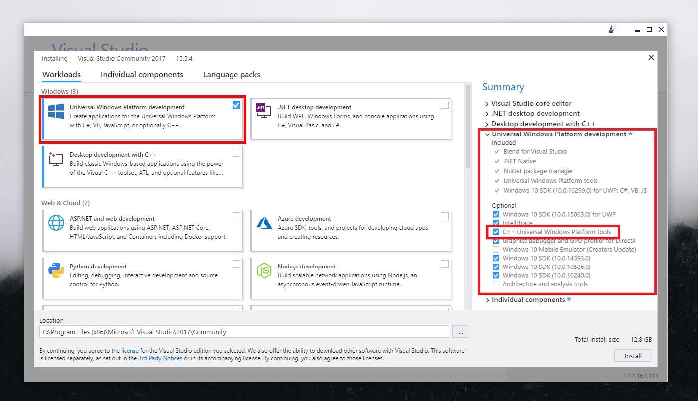

--- 
title: Develop an app for your device
author: saraclay 
ms.author: saclayt 
ms.date: 04/17/2018 
ms.topic: article 
description: Learn about how to add and develop apps for your device
keywords: Windows 10 IoT Core, Get Started, develop apps, apps
--- 

# Develop an app for your device

Now that you have a working device with the default app running, you'll want to take your device to the next level by developing and deploying an app on your device. Before diving into any samples, you'll need a few things...

* Download [Visual Studio 2017](https://www.visualstudio.com/downloads/) for development.
* Download the [Windows IoT Core Extension for VS Code](https://marketplace.visualstudio.com/items?itemName=ms-iot.windowsiot)

If you're planning to use C++ for your projects, when downloading Visual Studio 2017, make sure to check the boxes the same way as the example below:

And if you're interested in developing background, Arduino Wiring or console applications in the future, you'll also want to download project templates from the [Visual Studio Gallery](https://marketplace.visualstudio.com/items?itemName=MicrosoftIoT.WindowsIoTCoreProjectTemplatesforVS15).

To get up and running with an app, we recommend starting with a suggested starter sample below. But if you're ready to deploy your own app, we've also provided helpful links in the section after.

## Suggested starter samples

* [Hello Blinky](https://github.com/Microsoft/Windows-iotcore-samples/tree/develop/Samples/HelloBlinky)
* [Hello World](https://github.com/Microsoft/Windows-iotcore-samples/tree/develop/Samples/HelloWorld)
* [IoT Startup App sample](https://github.com/Microsoft/Windows-iotcore-samples/tree/develop/Samples/IoTStartApp)
* [RPi Cognitive Service sample](https://github.com/Microsoft/Windows-iotcore-samples/tree/develop/Samples/RPiCognitiveService) 

Once you've deployed your app - congratulations, you've finished this quickstarter! Continue to play around or, if you have a few ideas bouncing around in your head, check out or documentation on commercializing with Windows 10 IoT. 

## App development resources

<table>
<colgroup>
<col width="50%" />
<col width="50%" />
</colgroup>
<thead>
<tr class="header">
<th align="left">Topic</th>
<th align="left">Description</th>
</tr>
</thead>
<tbody>

<tr class="odd">
<td align="left">
[Developing foreground applications](../../develop-your-app/buildingappsforiotcore.md)
</td>
<td align="left">
Learn about the different languages that are supported on Windows 10 IoT Core as well as the UWP and non-UWP app types that are supported.
</td>
</tr>

<tr class="odd">
<td align="left">
[Developing background applications](../../develop-your-app/backgroundapplications.md)
</td>
<td align="left">
Learn about the different languages that are supported on Windows 10 IoT Core as well as the UWP and non-UWP app types that are supported.
</td>
</tr>

<tr class="odd">
<td align="left">
[Deploy an App with Visual Studio](../../develop-your-app/appdeployment.md)
</td>
<td align="left">
Learn how to deploy your different apps with Visual Studio to your Windows 10 IoT Core device.
</td>
</tr>

<tr class="odd">
<td align="left">
[Debug your app using Remote Console App Debugging](../../develop-your-app/remotedebugging.md)
</td>
<td align="left">
Learn how to debug your apps using Remote Console App Debugging in Visual Studio.
</td>
</tr>

<tr class="odd">
<td align="left">
[Install your app on your Windows 10 IoT Core device](../../develop-your-app/appinstaller.md)
</td>
<td align="left">
Learn how to install your app to your Windows 10 IoT Core device.
</td>
</tr>

</tbody>
</table>
