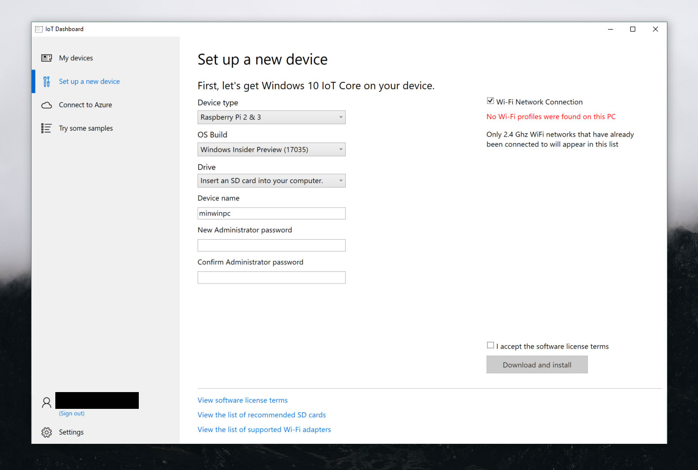
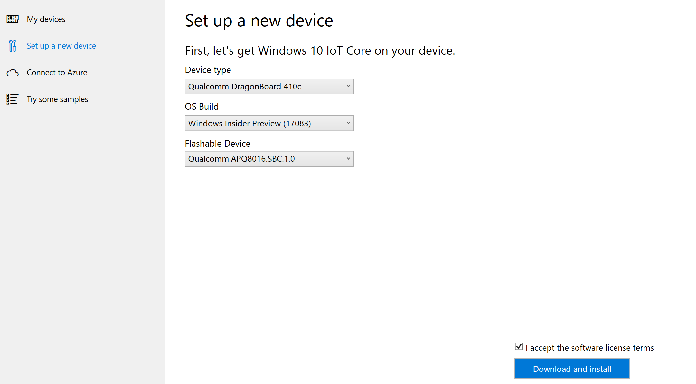
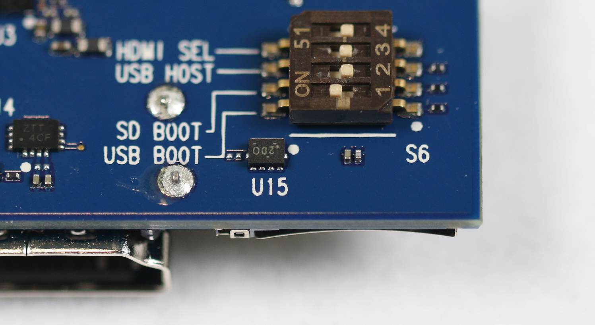

--- 
title: Setting up your device
ms.author: saclayt 
ms.date: 04/10/2018 
ms.topic: article 
description: Learn about how to set up your device with Windows 10 IoT Core using a SD Card.
keywords: Windows 10 IoT Core, SD Card, Windows 10 IoT Core Dashboard
--- 

# Setting up your device

Below you'll find four different ways to flash your device with Windows 10 IoT Core. Based on the chart included in the [list of suggested boards for prototyping](PrototypeBoards.md), follow the appropriate directions. Use the right column to navigate between these different methods of flashing.

> [!IMPORTANT]
> When the "format this disk" pop up comes up, do _not_ format the disk. We are working on a fix for this issue.

## Using the IoT Dashboard (Raspberry Pi and MinnowBoard)

> [!Video https://www.youtube.com/embed/JPRUbGIyODY]

> [!IMPORTANT]
> The latest 64-bit firmware for MinnowBoard Turbot can be found on the [MinnowBoard website](https://minnowboard.org/tutorials/updating-the-firmware) (skip step 4 on the MinnowBoard site's instructions).

> [!TIP]
> We recommend using a high-performance SD card for increased stability as well as plugging your device into an external display to see the default application booting up.

1. Download the Windows 10 IoT Core Dashboard [here](https://developer.microsoft.com/en-us/windows/iot/Downloads).
2. Once downloaded, open the Dashboard and click on _set up a new device_ and insert a SD card into your computer.
3. Fill out all of the fields as indicated.
4. Accept the software license terms and click _Download and install_. You'll see that Windows 10 IoT Core is now flashing onto your device.

### Connecting to a network

#### Wired connection
If your device comes with an Ethernet port or USB Ethernet adapter support to enable a wired connection, attach an Ethernet cable to connect it to your network.

#### Wireless connection
If your device supports Wi-Fi connectivity and you've connected a display to it, you'll need to:

1. Go into your default application and click the settings button next to the clock.
2. On the settings page, select _Network and Wi-Fi_.
3. Your device will begin scanning for wireless networks.
4. Once your network appears in this list, select it and click *Connect*.

If you haven't connected and display and would like to connect via Wi-Fi, you'll need to:

1. Go to the IoT Dashboard and click on _My Devices_.
2. Find your unconfigured board from the list. Its name will begin with "AJ_"... (e.g. AJ_58EA6C68). If you don't see your board appear after a few minutes, try rebooting your board.
3. Click on *Configure Device* and enter your network credentials. This will connect your board to the network.

> [!NOTE]
> Wifi on your computer will need to be turned on in order to find other networks.

### Connecting to Windows Device Portal

Use the [Windows Device Portal](../../manage-your-device/DevicePortal.md) to connect your device through a web browser. The device portal makes valuable configuration and device management capabilities available. 

## Using the IoT Dashboard (DragonBoard 410c)

> [!Video https://www.youtube.com/embed/iPm57hGq-Q8]

> [!TIP]
> We recommend plugging your device into an external display to see the default application booting up.

1. Download the Windows 10 IoT Core Dashboard [here](https://developer.microsoft.com/en-us/windows/iot/Downloads).
2. Once downloaded, open the Dashboard and select "Qualcomm DragonBoard 410c". Then _sign in as a Windows Insider_. You need to be signed in as an insider in order to flash DragonBoard 410c. 
3. Connect the Qualcomm board to the developer machine using a microUSB cable.
4. Power on your Dragonboard using a 12V (>1A) power supply while holding down the volume up (+) button. The device - when connected to a display - should show the image of a hammer, a lightning bolt, and a cog. 
5. The device should now be visible on the Dashboard as shown below. Select the appropriate device.
6. Accept the software license terms and click _Download and install_. You'll see that Windows 10 IoT Core is now flashing onto your device.

### Connecting to a network

#### Wired connection
If your device comes with an Ethernet port or USB Ethernet adapter support to enable a wired connection, attach an Ethernet cable to connect it to your network.

#### Wireless connection
If your device supports Wi-Fi connectivity and you've connected a display to it, you'll need to:

1. Go into your default application and click the settings button next to the clock.
2. On the settings page, select _Network and Wi-Fi_.
3. Your device will begin scanning for wireless networks.
4. Once your network appears in this list, select it and click _Connect_.

If you haven't connected and display and would like to connect via Wi-Fi, you'll need to:

1. Go to the IoT Dashboard and click on _My Devices_.
2. Find your unconfigured board from the list. Its name will begin with "AJ_"... (e.g. AJ_58EA6C68). If you don't see your board appear after a few minutes, try rebooting your board.
3. Click on _Configure Device_ and enter your network credentials. This will connect your board to the network.

> [!NOTE]
> Wifi on your computer will need to be turned on in order to find other networks.

### Connecting to Windows Device Portal

Use the [Windows Device Portal](../../manage-your-device/DevicePortal.md) to connect your device through a web browser. The device portal makes valuable configuration and device management capabilities available. 

## Flashing with eMMC (for DragonBoard 410c, other Qualcomm devices)

1. Download and install the DragonBoard Update Tool for your [x86](https://developer.qualcomm.com/download/db410c/windows-10-iot-update-tool-dragonboard-410c-x86.zip) or [x64](https://developer.qualcomm.com/download/db410c/windows-10-iot-update-tool-dragonboard-410c-x64.zip) machine.
2. Download the [Windows 10 IoT Core DragonBoard FFU](https://developer.microsoft.com/en-us/windows/iot/Downloads).
3. Double-click on the downloaded ISO file and locate the mounted Virtual CD-drive. This drive will contain an installer file (.msi); double-click on it. This creates a new directory on your PC under `C:\Program Files (x86)\Microsoft IoT\FFU\` in which you should see an image file, "flash.ffu".
4. Ensure your DragonBoard is in download mode by setting the first boot switch on the board to USB Boot, as shown below. Then, connect DragonBoard the host PC via a microUSB cable, then plug in the DragonBoard to a 12V (> 1A) power supply.
5. Start the DragonBoard Update Tool, which should detect that the DragonBoard is connect to your PC with a green circle. "Browse" to the DragonBoard's FFU that you downloaded, then click the _Program_ button.
6. Once the download is complete, disconnect the power supply and microUSB cable from the board and toggle the USB Boot switch back to _OFF_. Connect a HDMI display, a mouse, and a keyboard to the DragonBoard and rec-onnect the power supply. After a few minutes, you should see the Windows 10 IoT Core default application. 

> [!NOTE]
> Make sure the device is now booting from the eMMC memory by entering the BIOS setup again and switching the Boot Drive order to load from the Hard Drive instead of from the USB Drive.

### Connecting to a network

#### Wired connection
If your device comes with an Ethernet port or USB Ethernet adapter support to enable a wired connection, attach an Ethernet cable to connect it to your network.

#### Wireless connection
If your device supports Wi-Fi connectivity and you've connected a display to it, you'll need to:

1. Go into your default application and click the settings button next to the clock.
2. On the settings page, select _Network and Wi-Fi_.
3. Your device will begin scanning for wireless networks.
4. Once your network appears in this list, select it and click _Connect_.

If you haven't connected and display and would like to connect via Wi-Fi, you'll need to:

1. Go to the IoT Dashboard and click on *My Devices*.
2. Find your unconfigured board from the list. Its name will begin with "AJ_"... (e.g. AJ_58EA6C68). If you don't see your board appear after a few minutes, try rebooting your board.
3. Click on *Configure Device* and enter your network credentials. This will connect your board to the network.

> [!NOTE]
> Wifi on your computer will need to be turned on in order to find other networks.

### Connecting to Windows Device Portal

Use the [Windows Device Portal](../../manage-your-device/DevicePortal.md) to connect your device through a web browser. The device portal makes valuable configuration and device management capabilities available. 

## Flashing with eMMC (for Up Squared, other Intel devices)

1. Download and install the [Windows Assessment and Deployment kit](https://docs.microsoft.com/en-us/windows-hardware/get-started/adk-install) with the correlating version of Windows 10 you're running.
2. Insert a USB drive into your machine.
3. Create a USB-bootable WinPE image:
* Start the Deployment and Imaging Tools Environment `(C:\Program Files (x86)\Windows Kits\10\Assessment and Deployment Kit\Deployment Tools)` as an administrator.
* Create a working copy of the Windows PE files. Specify either x86, amd64 or ARM: `Copype amd64 C:\WINPE_amd64`
* Install Windows PE to the USB flash drive, specifying the WinPE drive letter below. More information can be found [here](https://docs.microsoft.com/en-us/windows-hardware/manufacture/desktop/winpe-create-usb-bootable-drive). `MMakeWinPEMedia /UFD C:\WinPE_amd64 P:`
4. Download the [Windows 10 IoT Core image](https://downloads.up-community.org/?post_type=wpdmpro&p=204&preview=true) by double-clicking on the downloaded ISO file and locating the mounted Virtual CD-drive.
5. This drive will contain an install file (.msi); double click it. This will create a new directory on your PC under C:\Program Files (x86)\Microsoft IoT\FFU\ in which you shoul d see an image file, "flash.ffu".
6. Download, unzip and copy the [eMMC Installer script](https://github.com/ms-iot/content/blob/develop/Resources/eMMCInstaller.zip) to the USB device's root directory, along with the device's FFU.
7. Connect the USB drive, mouse, and keyboard to the USB hub. Attach the HDMI display to your device, the device to the USB hub, and the power cord to the device.
8. Go to the BIOS setup of the device. Select *Windows* as the Operating system and set the device to boot from your uSB drive. When the system reboots, you will see the WinPE command prompt. Switch the WinPE prompt to the USB Drive. This is usually C: or D: but you may need to try other driver letters.
9. Run the eMMC Installer script, which will install the Windows 10 IoT Core image to the device's eMMC memory. When it completes, press any key and run `wpeutil reboot`. The system should boot into Windows 10 IoT Core, start the configuration process, and load the default application.

> [!NOTE]
> Make sure the device is now booting from the eMMC memory by entering the BIOS setup again and switching the Boot Drive order to load from the Hard Drive instead of from the USB Drive.

### Connecting to a network

#### Wired connection
If your device comes with an Ethernet port or USB Ethernet adapter support to enable a wired connection, attach an Ethernet cable to connect it to your network.

#### Wireless connection
If your device supports Wi-Fi connectivity and you've connected a display to it, you'll need to:

1. Go into your default application and click the settings button next to the clock.
2. On the settings page, select _Network and Wi-Fi_.
3. Your device will begin scanning for wireless networks.
4. Once your network appears in this list, select it and click _Connect_.

If you haven't connected and display and would like to connect via Wi-Fi, you'll need to:

1. Go to the IoT Dashboard and click on _My Devices_.
2. Find your unconfigured board from the list. Its name will begin with "AJ_"... (e.g. AJ_58EA6C68). If you don't see your board appear after a few minutes, try rebooting your board.
3. Click on _Configure Device_ and enter your network credentials. This will connect your board to the network.

> [!NOTE]
> Wifi on your computer will need to be turned on in order to find other networks.

### Connecting to Windows Device Portal

Use the [Windows Device Portal](../../manage-your-device/DevicePortal.md) to connect your device through a web browser. The device portal makes valuable configuration and device management capabilities available. 

