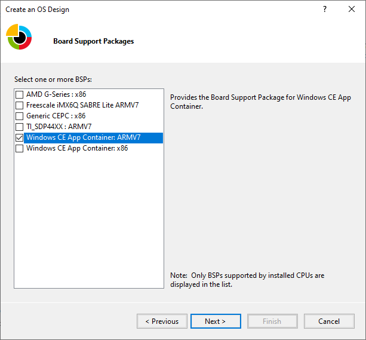

# Getting Started with Windows CE App Container

The Windows CE App Container is a technology that allows most CE applications to run on top of Windows 10 IoT Core.

The solution is built in two stages. The first stage creates a Windows CE 2013 image using a BSP for either x86 or ARM32 architecture. Then in the second stage, this image is included in a Windows 10 IoT Core image that utilizes the x64 or ARM32 BSP for the specific device hardware where the solution will be installed.


For more information about this architecture, please review this video: [Modernizing Windows CE Devices](https://channel9.msdn.com/Shows/Internet-of-Things-Show/Modernizing-Windows-CE-Devices).

## Prerequisites
The Windows CE App Container software requires an updated version of [Windows Compact 2013 (Build number 6294 from June 2020 or later)](https://support.microsoft.com/help/4566035/update-for-windows-embedded-compact-2013) along with updated [Windows 10 IoT Core Packages for x64 and ARM32 (August 2020 update or later)](https://support.microsoft.com/help/4565349/windows-10-update-kb4565349). To obtain the latest packages for Windows 10 IoT Core, please contact your Microsoft distributor.

> [!NOTE]
> You must have a valid [IoT Core Services](https://docs.microsoft.com/windows-hardware/manufacture/iot/iotcoreservicesoverview) subscription to distribute a device that employs the CE App Container technology.

Additionally, you will need the following:

- [Microsoft Visual Studio 2013 Professional or Visual Studio 2015
    Professional](<https://visualstudio.microsoft.com/vs/>). These versions are required for both the Application Builder and Platform Builder tools.

- [Application Builder for Windows Embedded Compact 2013](<https://www.microsoft.com/download/details.aspx?id=38819>)

- Platform Builder for Windows Compact 2013

- A Working IoT Core BSP

- The tools referenced in the [Windows IoT Manufacturing
    Guide](https://docs.microsoft.com/windows-hardware/manufacture/iot/set-up-your-pc-to-customize-iot-core)
- Remember to install the updated components in place of the ones referenced in this guide (Windows 10 ADK and Windows 10 ADK PE Add-on, IoT Core ADK Add-ons, Windows 10 IoT Core Dashboard)


## Configuring, Building, and Packaging CE for the Windows CE App Container

The [process for creating a Windows Embedded Compact 2013 image](https://docs.microsoft.com/previous-versions/windows/embedded/jj200349(v=winembedded.80)) has not been updated significantly. The general process for building an image is:

1. Create OS Design project with Platform Builder

2. Select the Platform Builder Board Support Package (BSP)

3. Choose the appropriate design template

4. Configure the options provided by the design template

5. Optionally add Sub-projects to the design project

6. Build the image

The primary change is in the selection of the correct BSP and additional considerations for the CE image. This guide assumes you are already familiar with the process to build a Windows CE system image, but it is worth looking more deeply at the changed section.

Step 2 is the only part of the previous OS Design project process that is changed when using the CE App Container, see below for additional details.

### Step 2 - Platform Builder BSP Selection

To support the Windows CE App Container, a new BSP that targets x86 and ARM architectures has been added to Platform Builder.

When creating an OS Design for the CE App Container, select either the “Windows CE App Container: x86” or “Windows CE App Container: ARMv7” (ARM32) depending on the underlying hardware for your IoT Core based device.

For example, if your target IoT Core device uses Intel hardware, you will select the “Windows CE App Container: x86” option. Alternatively, if your IoT Core hardware uses NXP i.MX6, you will select the “Windows CE App Container: ARMv7” option.



After doing this, you will have the ability to configure the options and sub-projects just like you would normally do for a Windows Embedded Compact image. These configurations will be built into the CE Container that you will deploy into your Windows 10 IoT Core image.

## Building the Windows 10 IoT Core Image

> [!NOTE]
> This process is covered in more detail in the labs that are part of the [Windows 10 IoT Core Manufacturing Guide](https://docs.microsoft.com/windows-hardware/manufacture/iot/create-a-basic-image). The section below only provides additional actions to execute at certain stages of the IoT Core image building process. It is highly recommended to familiarize yourself with the Windows 10 IoT Core Manufacturing Guide before proceeding.

### Process overview

Unlike the process of building a Windows Embedded Compact image, Windows 10 IoT Core decouples yet integrates the creation of firmware, board support packages, image definition, and application inclusion. By utilizing different technologies for these pieces, you can separate the work you need to do amongst different teams or individuals in your organization.

The basic steps in creating an image are:

1. [Create a
    workspace](https://docs.microsoft.com/windows-hardware/manufacture/iot/create-a-basic-image)

2. [Import the appropriate IoT Core Board Support Package
    (BSP)](https://docs.microsoft.com/windows-hardware/manufacture/iot/create-a-basic-image)

3. Import the CE App Container you created previously

4. [Create your product
    definition](https://docs.microsoft.com/windows-hardware/manufacture/iot/create-a-basic-image)

5. [Add features and applications to your
    product](https://docs.microsoft.com/windows-hardware/manufacture/iot/deploy-your-app-with-a-standard-board)

6. [Build your Full Flash Update
    (FFU)](https://docs.microsoft.com/windows-hardware/manufacture/iot/deploy-your-app-with-a-standard-board)

7. [Deploy the FFU to the device and
    test](https://docs.microsoft.com/windows-hardware/manufacture/iot/create-a-basic-image)

8. [Finalize and sign your retail
    FFU](https://docs.microsoft.com/windows-hardware/manufacture/iot/build-retail-image)

There are detailed guides for each of these steps as part of the [Windows 10 IoT Core Manufacturing Guide](https://docs.microsoft.com/windows-hardware/manufacture/iot/create-a-basic-image). While some of these steps are like the process of using Platform Builder (PB) to create a device image, it is worth exploring some areas more deeply.

#### Step 1 - Create a Workspace

Review the documentation, [Create a Basic Image](https://docs.microsoft.com/windows-hardware/manufacture/iot/create-a-basic-image), in the IoT Core Manufacturing Guide to learn how to create a workspace.

#### Step 2 - Import the appropriate IoT Core Board Support Package (BSP)

Review the documentation, [Create a Basic Image](https://docs.microsoft.com/windows-hardware/manufacture/iot/create-a-basic-image), in the IoT Core Manufacturing Guide for support for your board.

#### Step 3 - Importing the Windows CE App Container

The Windows CE App Container is created using PB as discussed above and imported into your IoT Core workspace by using the [Import-IoTCEPAL](https://github.com/ms-iot/iot-adk-addonkit/blob/master/Tools/IoTCoreImaging/Docs/Import-IoTCEPAL.md#Import-IoTCEPAL) command. This command will copy the required contents from the CE flat release directory into the IoT ADK workspace. If invoked multiple times, the previous state is backed up under the `Source-\$Arch\CEPAL.OLD` directory in the workspace.

#### Step 4 - Create your product definition

Review the documentation, [Create a Basic Image](https://docs.microsoft.com/windows-hardware/manufacture/iot/create-a-basic-image), in the IoT Core Manufacturing Guide to create your product definition.


#### Step 5 - Adding CE App Container to a product

Once you have imported your CE App Container definition to your workspace you will need to ensure that you run the [Add-IoTCEPAL](https://github.com/ms-iot/iot-adk-addonkit/blob/master/Tools/IoTCoreImaging/Docs/Add-IoTCEPAL.md#Add-IoTCEPAL) command, which will add a reference to CE App Container packages to the relevant product OEMInput.xml files (Test and Retail).

The next step is to use the [Add-IoTProductFeature](https://github.com/ms-iot/iot-adk-addonkit/blob/master/Tools/IoTCoreImaging/Docs/Add-IoTProductFeature.md#Add-IoTProductFeature) command to add the IOT\_CEPAL feature to the OEMInput.xml. This adds the Windows Host support for the Windows CE App Container (Windows CE front-end UWP app + support drivers) to  our product definition and includes the CE App Container in the default Apps group. We’ll discuss start-up configuration in a later section.

#### Step 6 - Build your CAB files

This is an important step during the creation of your FFU and should be done whenever you change a configuration, add/change an application or drivers. You will use the [New-IoTCabPackage](https://github.com/ms-iot/iot-adk-addonkit/blob/master/Tools/IoTCoreImaging/Docs/New-IoTCabPackage.md#New-IoTCabPackage) with the “All” option. You can also build Single features as needed but in general you should rebuild all the packages prior to the step of building your FFU as best practice.

#### Step 7 - Deploying your FFU to your device

Once the image is built, you can deploy it to a device. This can be done from the command line using [DISM](https://docs.microsoft.com/windows-hardware/manufacture/desktop/what-is-dism), via your device-specific deployment process or by using the [Windows 10 IoT Core Dashboard](https://docs.microsoft.com/windows/iot-core/connect-your-device/iotdashboard). More details are available as part of the [Windows 10 IoT Core Manufacturing Guide](https://docs.microsoft.com/windows-hardware/manufacture/iot/create-a-basic-image).

##### Deploying the Windows CE App Container to a device when using an existing FFU

The CE CABs are deployable packages on IoT Core. If there is an existing IoT Core image, these CABs can be deployed to the device using the `APPLYUPDATE` command. First copy the CABs to the device, then stage and commit the CABs with `APPLYUPDATE`. Do note that updating this way respects package versioning, so if updated versions of packages are to be deployed to the device, they must have a greater version number. (See the Set-IoTCabVersion command in the IoT ADK environment). More information on this can be found in [Create and Install Packages](https://docs.microsoft.com/enus/windows-hardware/manufacture/iot/create-install-package.)

#### Step 8 - Building a retail image

Having a properly signed image is an important part of securing and updating a device. For Windows 10 IoT Core, this appears as the difference between Test signed and Retail signed builds. You should never publicly deploy a test signed image. Test signed images should only be used for debug purposes and you should correct any errors or configuration changes prior to creating your final retail signed image.

> [!NOTE]
> In addition to the development and deployment tools installed on your machine you will also need the following to enable retail signing:
>
> - A retail code-signing certificate
> - A cross-signing certificate

### Properly signing and including your applications

If you have one or more custom applications that you want to include in your Windows 10 IoT Core retail image, you need to verify that these applications are signed properly when including them in your retail image.

## Additional Information

### Adding new applications to an existing image

To add a new application to an existing OS Design you can either add the project as a sub-project to the OS Design Project or you can create normal deployment CAB packages to deploy those to the device as part of the initial device setup.

### Packaging Best Practices

You should always aim to make sure packages are as granular as possible to reduce update time.

Since a package is the smallest unit of updating, make sure that each package is as small as possible. When building in Platform Builder, the generated packages are separated according to memory section and module/file type according to the bib file automatically.

- For custom assets built in Platform Builder and packaged through OSDesign.bib, consider adding custom assets into a separate memory section in the BIB (not in NK), so that updates to custom code can ship separate from updates to the CE OS.

- For custom assets added through the IoT ADK packaging commands: Make sure the packages created are as small as possible.

### Adding other things to the Platform Builder package

In general, the recommendation is not to modify the resulting package produced by Platform Builder to include additional components into the system image. Instead, follow the [Windows 10 IoT Core manufacturing guide](https://docs.microsoft.com/windows-hardware/manufacture/iot/iot-core-manufacturing-guide). However, if files must be added to the package that is created by Platform Builder, follow your existing process. When adding content to the package generated by PB, consider the following:

- There is a maximum size for packages (about 400 MB) and exceeding this size will prevent updating.

- Updates happen on package granularity. If a single asset in the package needs to be updated, then all the assets of that package will be updated at the same time. To reduce the size of updates, isolate content into separate packages to minimize the overall update size.

### Adding additional files through Platform Builder

The packaging process detailed above is driven by the same inputs that go into building a CE BIN file. So, if the files are referenced in OSDesign.bib and registry entries are added to OSDesign.reg, the `MAKEIMG` process will include these files in the resulting CAB file. During this process `MAKEIMG` will now:

1. `ROMIMAGE` will create a directory named `CEPAL\_PKG` within the Flat Release Directory (FRD) that stages an installed directory structure for Windows CE for CEPAL.

2. `ROMIMAGE` inventories all CE files that were placed into `CEPAL\_PKG` based on CE BIB files.

3. `ROMIMAGE` will create multiple WM.XML files for each memory section. This is done so that updates can be pushed in a more granular fashion as the minimum unit of update is a package.

4. `ROMIMAGE` will create  that references all the created packages.

All of the packages created will be named with a fixed prefix of `“%OEM\_NAME%.WindowsCE.\*”`, where `%OEM\_NAME%` is populated during the IoT Core creation process when calling [New-IoTCabPackage](https://github.com/ms-iot/iot-adk-addonkit/blob/master/Tools/IoTCoreImaging/Docs/New-IoTCabPackage.md). The Package Name within the name space is derived from the memory section in the BIB file (e.g. NK) followed by modules / files (also determined by the BIB file).

#### Communicating between Windows Embedded Compact 2013 and Windows 10 IoT Core applications

The recommended approach to communicate between applications running in the CE Container is to use Local Loopback. You can read more on [Local Loopback in this document.](https://docs.microsoft.com/windows/iot-core/develop-your-app/loopback)

### Automatically starting the CE App Container application

To automatically start the CE Container application, you can create a [Provisioning Package](https://docs.microsoft.com/windows-hardware/manufacture/iot/add-a-provisioning-package-to-an-image) that sets the startup application to “Microsoft.Windows.IoT.CEPAL.DkMonUWP\_cw5n1h2txyewy!App”, and included
this provisioning package in the image. You will also need to remove the default startup application by using the [Remove-IoTProductFeature](https://github.com/ms-iot/iot-adk-addonkit/blob/master/Tools/IoTCoreImaging/Docs/Remove-IoTProductFeature.md) command and removing the IOT\_BERTHA Feature ID from the IoT Core product definition.

### Available Configuration settings for the Windows CE App Container

#### Registry-based configuration in CE

##### Non-Executable Stack by Default

The Windows CE App Container has disabled executable stack pages by default to improve security. However, some legacy applications may rely on this behavior to run correctly. To Enable an Executable Stack, set the following registry value in the CE image (It is recommended that this goes into OSDesign.reg in Platform Builder)

```AsciiDoc
KeyPath = HKEY\_LOCAL\_MACHINE\CEPAL
ValueName = MemoryOptions Type = REG\_DWORD
Value = 1
```

##### 16-bit 565 Override for GWES

If the Windows CE App Container is configured with a 32-bit display, then 16-bit to 32-bit RGB conversions are done by GWES are done with the assumption that 16-bit RGB pixel data is in RGB555 format. If bitmap resources are in 16-bit 565, and conversion to a RGB555 of these resources is not possible, GWES’s default conversion behavior can be changed via a registry key. Create the following registry key:

```AsciiDoc
HKEY\_LOCAL\_MACHINE\SYSTEM\GDI\16bpp565RGBPalette.
```

#### Registry-based configuration in Host (IoT Core)

##### Configuring serial ports for the Windows CE App Container

Host Serial ports need to be mapped into the CE environment. This mapping exists in registry in IoT Core and needs to be configured by the image creator.

Under `HKEY\_CURRENT\_USER\Software\Microsoft\Windows NT\CurrentVersion\CEPAL\Devices\Serial`, configuration entries exist to map Guest COM ports to Host COM ports using the following schema.

```AsciiDoc
KeyPath = HKEY\_CURRENT\_USER\Software\Microsoft\Windows NT\CurrentVersion\CEPAL\Devices\Serial\0

ValueName = Guest Type = REG\_SZ Value = COM1

ValueName = Host

Type = REG\_SZ

Value = \\?\Some\DeviceInterface\Path

KeyPath= HKEY\_CURRENT\_USER\Software\Microsoft\Windows NT\CurrentVersion\CEPAL\Devices\Serial\1

ValueName = Guest Type = REG\_SZ Value = COM2

ValueName= Host Type = REG\_SZ

Value = \\?\Some\Other\DeviceInterface\Path
```

If the registry path above does not exist when CE is booted, a default configuration will be written based on discovered serial devices on the system.

#### File Based configuration in Host

The CE Container can be configured using a local file on the host `C:\WindowsCE\CEEnvConfig.json`. Here is a sample of this configuration file:

```xml
{
 "OEMOptions" :
    {
     "GUI" : true,
     "Width" : 1024,
     "Height" : 768, "FillScreen" : true, "ColorDepth" : 32,
     "RefreshRate" : 30, "noAslrSupport" : true, "OemConfigApp" : "",
     "OemConfigFile" : ""
    },
 "CEPALDevOptions" :
    {
     "VsDebugMode" : true, "FastDebugBoot" : false
    }
 }
 ```

#### OEMOptions

| Key           | Description                                                                                                            |
|---------------|------------------------------------------------------------------------------------------------------------------------|
| GUI           | Launch the CE app container with UI (default true)                                                                     |
| Width         | Width of the CE app container display (default 1024)                                                                   |
| Height        | Height of the CE app container display (default 768)                                                                   |
| FillScreen    |                                                                                                                        |
| ColorDepth    | Sets default bits per pixel (default 32)                                                                               |
| RefreshRate   | How many times the display is redrawn per second                                                                       |
| noAslrSupport | Disables address space layout randomization in the CE app container (default true)                                     |
| OEMConfigApp  | Package Family Name of an OEM provided app that should be launched for configuration.                                  |
| OEMConfigFile | Path to a file that contains additional configuration options shared between the OEMConfigApp and the CE app container |

The CE app container only makes one network interface available for use. If multiple NICs are present in the Host System, one interface must be selected in the Host Registry to ensure the selected NIC is deterministic.

##### OEMConfigFile

The OEMConfigFile is specified in `C:\WindowsCE\CEEnvConfig.json`. Make sure this file can be read by a UWP application. The following is a sample:

```xml
{
   “FactoryReset”: false, “PlatformBuilderDebugMode”: false,
   “NetInterface”: “Some Network Profile Id”
}
```

Options:

| Key                      | Description                                                                              |
|--------------------------|------------------------------------------------------------------------------------------|
| FactoryReset             | Used by the config app to signal the CE App Container to dump persistent state.          |
| PlatformBuilderDebugMode | Used to boot the CE App Container with KITL support for debugging with Platform Builder. |
| NetInterface             | Select a Network Interface for CE based on profile name.                                 |


## References

- [Get the tools needed to customize Windows 10 IoT Core](https://docs.microsoft.com/windows-hardware/manufacture/iot/set-up-your-pc-to-customize-iot-core)
- [IoT Core Board Supported Packages (BSP)](https://docs.microsoft.com/windows-hardware/manufacture/iot/bsphardware)
- [IoT Core Manufacturing Guide](https://docs.microsoft.com/windows-hardware/manufacture/iot/iot-core-manufacturing-guide)
- [Windows 10 IoT Core Dashboard](https://docs.microsoft.com/windows/iot-core/connect-your-device/iotdashboard)
- [Create and Install Packages](https://docs.microsoft.com/windows-hardware/manufacture/iot/create-install-package)
